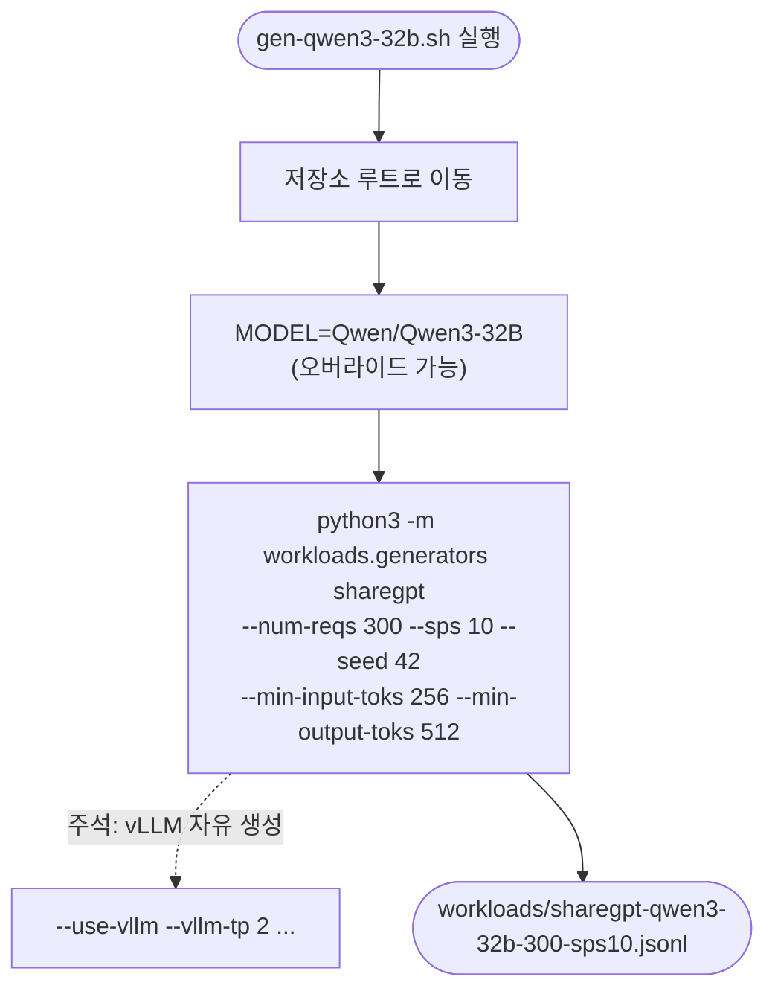

# `workloads/examples/gen-qwen3-32b.sh` 분석

Qwen3-32B(dense) 모델용 **ShareGPT 워크로드 JSONL을 생성**하는 템플릿
스크립트입니다.

## 개요

| 항목 | 내용 |
| --- | --- |
| 목적 | `sharegpt-qwen3-32b-300-sps10.jsonl` 생성 |
| 실행 위치 | vLLM Docker 컨테이너(`/workspace`) |
| 모델 | `Qwen/Qwen3-32B` (dense 32B) |
| 소스 데이터셋 | `shibing624/sharegpt_gpt4` |

## 블록 다이어그램

## 단계별 분석

- 세 예제 스크립트 중 하나로, 구조는 `gen-llama-3.1-8b.sh`와 동일하고 모델 id와
  출력 파일명만 다릅니다.
- dense 32B 모델의 처리량 향상을 위해 (자유 생성 시) 두 GPU에 걸친 TP=2를 권장합니다
  (주석의 `--vllm-tp 2`).
- `--model`은 HF id(자동 다운로드) 또는 로컬 체크포인트 경로를 받습니다.

## 참고

- 생성된 JSONL은 flat 형식(요청당 한 줄, prefix caching을 위한 `input_tok_ids`
  포함)입니다.
- 자유 생성이 필요하면 하단 주석의 vLLM 옵션을 해제하세요.
