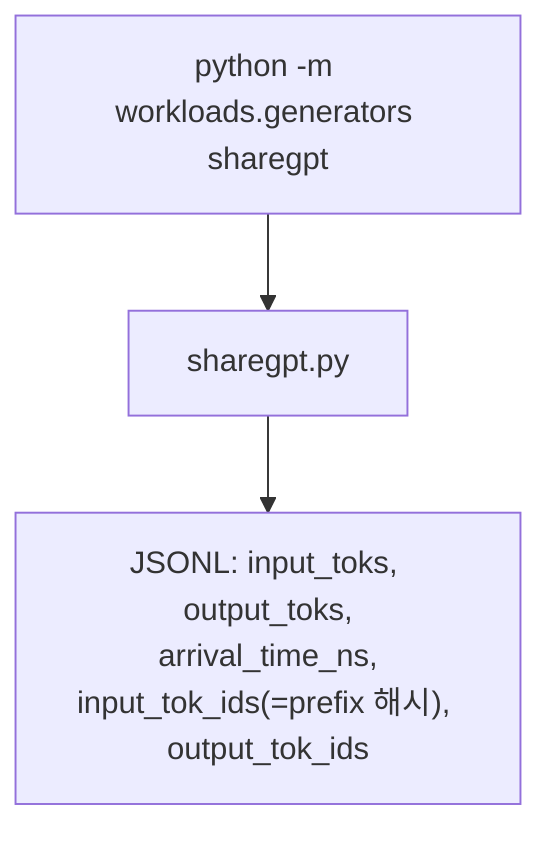

# `workloads/generators/__init__.py` 분석

**워크로드 생성기 패키지 초기화**입니다. 시뮬레이터가 기대하는 JSONL 형식의
요청 트레이스를 생성하는 생성기들을 담습니다. `python -m workloads.generators
<name> ...`로 호출합니다.

## 개요

| 항목 | 내용 |
| --- | --- |
| 역할 | 패키지 docstring(JSONL 스키마 + 제공 생성기) |
| 호출 | `python -m workloads.generators sharegpt ...` |
| 제공 | `sharegpt` — ShareGPT 대화 → 시뮬레이터 워크로드 |

## 블록 다이어그램

## JSONL 스키마

| 필드 | 의미 |
| --- | --- |
| `input_toks` / `output_toks` | 입력/출력(목표) 토큰 수 |
| `arrival_time_ns` | 도착 타임스탬프(ns) |
| `input_tok_ids` | 토큰화된 입력(prefix-cache 해시로 사용) |
| `output_tok_ids` | 토큰화된 출력(정보용) |

## 참고

- 생성기는 `rate`/`limit`/`seed`를 설정할 수 있습니다.
