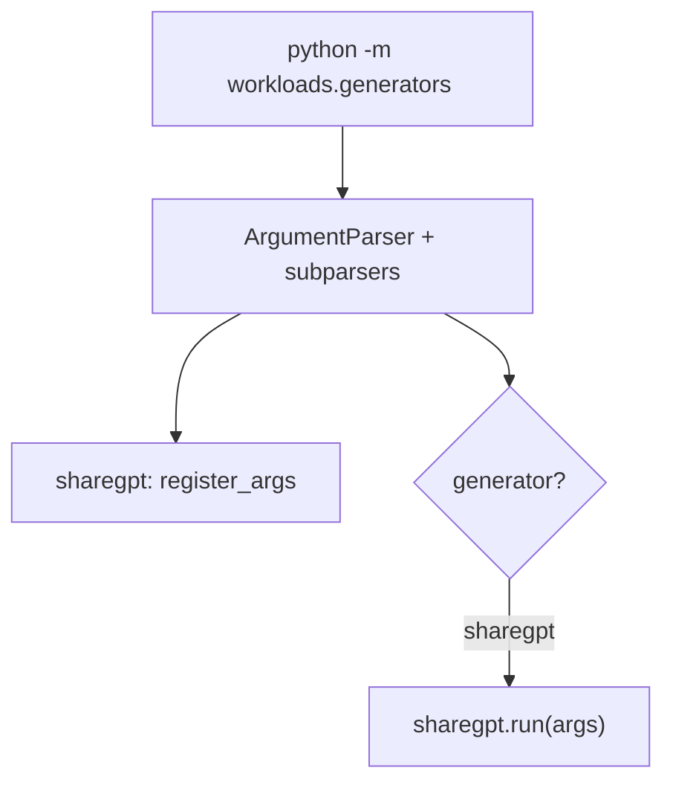

# `workloads/generators/__main__.py` 분석

**워크로드 생성기 CLI 디스패치**입니다. 서브커맨드(`sharegpt` 등)를 선택해 해당
생성기의 인자를 등록하고 실행합니다.

## 개요

| 항목 | 내용 |
| --- | --- |
| 역할 | 생성기 서브커맨드 구성 및 디스패치 |
| 실행 | `python -m workloads.generators sharegpt ...` |
| 지연 임포트 | 생성기 모듈을 필요 시점에만 임포트 |

## 블록 다이어그램

## 주요 구성 요소

| 요소 | 역할 |
| --- | --- |
| `main` | 서브파서 구성, 생성기 인자 등록, 디스패치 |

## 참고

- 생성기 모듈(`sharegpt`)의 `register_args`/`run`을 지연 임포트합니다.
- 새 생성기 추가는 서브파서 등록 + 디스패치 분기 한 줄이면 됩니다.
