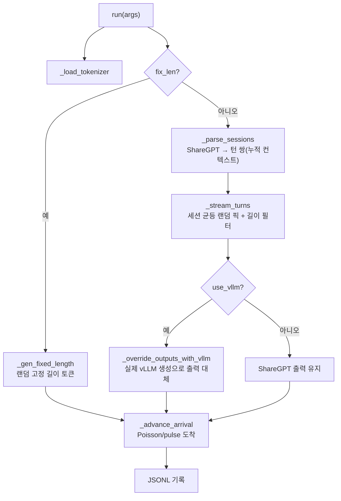

# `workloads/generators/sharegpt.py` 분석

**ShareGPT → LLMServingSim JSONL 생성기**입니다. 다중 턴 ShareGPT 대화를
`(human, gpt)` 턴 쌍으로 분할하여 각 턴을 하나의 요청으로 만듭니다(입력=누적 컨텍스트
+현재 프롬프트, 출력=gpt 응답). 세션을 균등 랜덤으로 뽑아 턴을 인터리브합니다.

## 개요

| 항목 | 내용 |
| --- | --- |
| 역할 | ShareGPT 대화 → flat 요청 JSONL |
| 모드 | tokenizer-only(기본), vLLM(`--use-vllm`), fix-len, pulse |
| 출력 | `input_toks/output_toks/arrival_time_ns/input_tok_ids/output_tok_ids` |
| 도착 | Poisson(rate `--sps`) 또는 pulse 버스트 |

## 블록 다이어그램

## 주요 구성 요소

| 요소 | 역할 |
| --- | --- |
| `register_args` | 인자(model/source/num-reqs/sps + 길이 필터 + fix-len/pulse/vLLM 플래그) |
| `run` | 파이프라인: tokenizer → 스트림 → (vLLM 대체) → JSONL |
| `_parse_sessions` | source를 세션(턴 쌍 리스트)으로 파싱, 컨텍스트 누적 |
| `_stream_turns` | 세션 균등 랜덤 픽 + 턴 토큰화 + 길이 제약 필터 |
| `_load_source` | 로컬 .json/.jsonl 또는 HF 데이터셋 로드 |
| `_gen_fixed_length` | fix-len 모드: 랜덤 고정 길이 토큰 |
| `_override_outputs_with_vllm` | vLLM offline batched로 출력 재생성 |
| `_advance_arrival` | 다음 요청 도착 시각(Poisson/pulse) |

## 모드 요약

- **tokenizer-only(기본)**: 입력·응답을 타깃 tokenizer로 토큰화, 출력은 ShareGPT
  자연 분포 유지(가장 빠름).
- **vLLM(`--use-vllm`)**: 실제 vLLM 엔진으로 자유 생성 → 출력이 모델의 실제 응답
  분포 반영.
- **fix-len**: 실험용 랜덤 고정 길이 입출력.
- **pulse**: `--pulse-n`개가 동시 도착 후 `--pulse-delay-sec` 점프(버스트).

## 참고

- vLLM 모드는 처리량 최적화(높은 max_num_seqs/batched_tokens, rate limit 없음)로
  전체 입력을 한 번에 batch-pack합니다.
- vLLM/datasets/transformers는 지연 임포트하여 필요 시에만 로드합니다.
